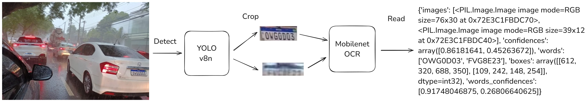

# Idea

Several months ago, I conceived a project and brought it to fruition.

The core idea was to develop a lightweight, custom Optical Character Recognition (OCR) system for reading license plates, specifically Brazilian ones. This system needed to be fast enough to run efficiently on a smartphone, operate offline (eliminating the need for a server), and ultimately support a mobile application. The app would capture images of passing vehicles, recognize their license plates, and send the extracted data to an API.

To guide my development process, I created a visual representation (that is already related to the final result):



# Models

My initial approach involved using a [YOLO](https://github.com/ultralytics/ultralytics) model for object detection. However, before proceeding, I needed a training dataset. Since I didn't have one, I manually collected images from the internet and while driving around. I then manually labeled these images and used the [SAM annotator](https://docs.ultralytics.com/reference/data/annotator/) from Ultralytics to streamline the process.

This object detection model worked reasonably well and seemed fast. The next step was recognizing the characters of the license plates themselves. Instead of relying on existing OCR libraries with numerous dependencies, I decided to create a custom OCR model.

My approach was to use a Convolutional Neural Network (CNN) as an encoder, followed by a decoder inspired by the GPT architecture. While Recurrent Neural Networks (RNNs) were common in the past for such tasks, I chose a transformer-based decoder operating at the character level due to the relatively small size of license plate strings.

My vocabulary was defined as:
```python
tokens = "<" + string.ascii_uppercase + string.digits + " " + ">" + "~"
stoi = {ch: i for i, ch in enumerate(tokens)}
itos = {i: ch for i, ch in enumerate(tokens)}
```
[platerec-model/config.py](https://github.com/pstwh/platerec-model/blob/0fe31042743e458801f0c2045ef2bd60640e21d7/config.py)

Here the `<` and `>` chars are start and end tokens. While the `~` is the padding token.

I then used the same image dataset for both object detection training, and now used to train the OCR, first I cropped images of license plate. I then generated a corresponding .txt file for each cropped image. This text file contained the ground truth license plate string, using a context length of 16, and including the start, end and padding tokens.

So my ground truth txt file is defined like: `<LQSJJ23>` and after on the `__get_item__` phase I added the `~` tokens. I used a context length of `16`.

My dataset file was structured as follows:
```python
class ImageTextDataset(Dataset):
    def __init__(self, data, transform=None):
        self.transform = transform
        self.data = data

    def __len__(self):
        return len(self.data)

    def __getitem__(self, idx):
        text_path = str(self.data[idx])
        image_path = text_path.replace(".txt", ".jpg")
        with open(text_path) as f:
            text = f.read()
        text = ''.join(list(filter(lambda c: c in tokens, text)))
        text = text.replace('<', '').replace('>', '')
        text = "<" + text + ">"
        if len(text) < 17:
            text = text + (17 - len(text)) * "~"
        textf = text[1:]
        text = text[:-1]

        image = Image.open(image_path).convert("RGB")
        image = self.transform(image=np.array(image))["image"]

        text = encode(text)
        text = torch.Tensor(text).long()
        textf = encode(textf)
        textf = torch.Tensor(textf).long()

        return image, text, textf
```
[platerec-model/dataset.py](https://github.com/pstwh/platerec-model/blob/0fe31042743e458801f0c2045ef2bd60640e21d7/dataset.py)


The model was really simple.
Its just a mobilenet v2 encoder and a simple gpt decoder. Can be check here: [platerec-model/model.py](https://github.com/pstwh/platerec-model/blob/main/model.py)

Surprisingly, this approach worked quite well.

# Inference

For inference I converted all models to onnx. And then I used [onnxruntime](https://github.com/microsoft/onnxruntime). So it is easy to integrate on any platform including mobile devices.

To make easy to use I decided to make two python libraries. 
- [Platedet](https://github.com/pstwh/platedet): to detect license plates in images
- [Platerec](https://github.com/pstwh/platerec): to recognize/read license plates in images

Of course the models are not perfect and can be improved. The models were trained on a relatively small dataset containing only Brazilian license plates. 

The project is open, so you can train your own models with your data.

# About 
I achieved a processing speed of over 80 frames per second (FPS) for the entire inference pipeline using TensorRT on an RTX 3060 GPU. This demonstrates how efficient and performant even smaller models can be when optimized.

For future work someday I plan to implement the mobile app I described and maybe try some ideas. Such as using just a single model that encode the entire image and decode directly without crop. I'm interested in exploring ideas from https://huggingface.co/blog/visheratin/vlm-resolution-curse for example. 

